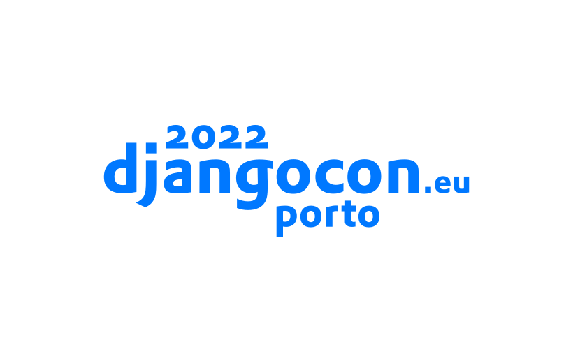

🌍 [2022.djangocon.eu](https://2022.djangocon.eu/)\
📍 Hybrid from Porto, Portugal 🇵🇹\
📅 September 21-25

## Code of Conduct

As a contributor, you can help us keep the Django community open and inclusive.
Please read and follow our [Code of Conduct](CODE_OF_CONDUCT.md).

## Getting Started

Get started contributing by reading our [Contributing](CONTRIBUTING.md) guidelines.

## Built With

* [Python](https://docs.python.org/3/) - Programming language
* [Django](https://docs.djangoproject.com/) - Web framework

## License

This project is licensed under the MIT License - see the [LICENSE.md](LICENSE.md) file for details.
